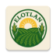

#  Elotlan- Agropecuarios a la mano

Una aplicación móvil para la gestión de fincas agrícolas desarrollada con Jetpack Compose.

> Estado del proyecto: En desarrollo

---

## Características

### 🎨 Diseño
- **Paleta de colores verdes**: Tonos naturales y agradables para modo claro y oscuro
- **TopAppBar verde**: Con título "Agro Manager" y botón de perfil
- **Material Design 3**: Siguiendo las últimas guías de diseño de Google
- **Responsive**: Adaptada a diferentes tamaños de pantalla

### 🏠 Navegación
- **5 pantallas principales**:
  - **Herramientas**: Tienda de productos agrícolas y ganaderos
  - **Producción**: Gestión y registro de producción de las parcelas
  - **Tu Finca**: Gestión personal de finca y parcelas
  - **Estadísticas**: Análisis de producción y rendimiento
  - **IA**: Herramientas de inteligencia artificial

### 📱 Funcionalidades

#### Herramientas (Tienda)
- **Dos categorías principales**:
  - **Agricultura**: Semillas, fertilizantes, herbicidas, insecticidas
  - **Ganadería**: Alimentos, medicamentos, suplementos, equipos
- **Tarjetas de producto** con:
  - Nombre y descripción del producto
  - Precio por unidad
  - Botón para agregar al carrito

#### Producción
- **Registro de producción** por parcela:
  - Selección de parcela configurada
  - Tipo de cultivo/producto
  - Cantidad cosechada
  - Calidad del producto
  - Fecha de cosecha
- **Historial de producción** con filtros por parcela y cultivo

#### Tu Finca
- **Gestión completa de la finca**:
  - Información básica (nombre, ubicación, descripción)
  - **Sistema de parcelas**:
    - Agregar/eliminar parcelas
    - Ubicación específica de cada parcela
    - Cultivos por parcela
  - **Botón de agregar finca** cuando no existe configuración

#### Perfil de Usuario
- Información del usuario
- Configuraciones de notificaciones
- Modo oscuro
- Ayuda y soporte
- Cerrar sesión

---

## Estructura del Proyecto

```
com.unitec.agrohack/
├── MainActivity.kt                # Configuración principal de la app
├── data/
│   └── Farm.kt                    # Modelos de datos
│   └── UserProfile.kt             # Modelos del usuario
├── presentation/
│   ├── components/
│   │   ├── AgroTopAppBar.kt       # Barra superior
│   │   ├── AgroBottomAppBar.kt    # Navegación inferior
│   │   └── FarmCard.kt            # Tarjeta de finca
│   └── screens/
│       ├── ToolsScreen.kt         # Pantalla tienda/herramientas
│       ├── ProductionScreen.kt    # Pantalla de producción
│       ├── MyFarmScreen.kt        # Pantalla mi finca
│       ├── StatisticsScreen.kt    # Pantalla estadísticas
│       ├── AIGenerationScreen.kt  # Pantalla IA
│       └── ProfileScreen.kt       # Pantalla perfil
└── ui/theme/
|   ├── Color.kt                   # Paleta de colores
|   ├── Theme.kt                   # Configuración del tema
|   └── Type.kt                    # Tipografía
└── ui/menus/
|   └── MainMenu.kt                # Pantalla de manejo de la UI
└── ui/
    ├── AuthScreen.kt              # Pantalla de registro/ iniciar sesion
    └── Farm.kt                    # Pantalla de ejemplo de las granjas
```

---

## Instalación

### Requisitos
- Android Studio Flamingo o superior
- Kotlin 1.8+
- Gradle 8.0+
- Android API 24+ (Android 7.0)

### Pasos
1. Clona el repositorio, puedes usar la terminal o descargar el proyecto

  - Windows y Mac
    - git: `git clone https://github.com/NightManuel13/Elotlan.git` , para branch `git checkout <rama>`
    - github cli: `gh repo clone NightManuel13/Elotlan`
  
2. Abre el proyecto en Android Studio
3. Sincroniza las dependencias de Gradle
4. Ejecuta la aplicación en un dispositivo o emulador

Comandos Gradle (alternativa desde terminal):
- Windows
  - `gradlew.bat assembleDebug`
  - `gradlew.bat installDebug`
- macOS/Linux
  - `./gradlew assembleDebug`
  - `./gradlew installDebug`

Limpiar el proyecto:
- Windows: `gradlew.bat clean`
- macOS/Linux: `./gradlew clean`

---

## Dependencias Principales

```gradle
// Compose BOM
implementation platform('androidx.compose:compose-bom:2024.02.00')

// Navigation
implementation "androidx.navigation:navigation-compose:2.7.6"

// Image Loading
implementation "io.coil-kt:coil-compose:2.5.0"

// Dependency Injection
implementation "com.google.dagger:hilt-android:2.48.1"
```

## Datos de Ejemplo

La aplicación incluye 5 fincas de ejemplo:

1. **Finca La Esperanza** - Café y aguacate orgánicos
2. **Hacienda Verde** - Aguacates premium
3. **Granja San Miguel** - Maíz y cereales
4. **Invernaderos del Norte** - Vegetales hidropónicos
5. **Finca Bella Vista** - Agricultura mixta sostenible

## Próximas Funcionalidades

- [ ] Carrito de compras funcional
- [ ] Integración con sistema de pagos
- [ ] Estadísticas avanzadas con gráficos
- [ ] Integración con APIs de clima
- [ ] Herramientas de IA para optimización de cultivos
- [ ] Notificaciones de cosecha y mantenimiento
- [ ] Modo offline
- [ ] Sincronización con Firebase

---

## Contribuir

Agradecemos las contribuciones. Por favor, asegúrate de seguir las Convenciones Semánticas (Conventional Commits) y de abrir un Pull Request claro.

1. Fork el proyecto
2. Crea una rama para tu feature (`git checkout -b feature/AmazingFeature`)
3. Commit tus cambios (`git commit -m 'Add some AmazingFeature'`)
4. Push a la rama (`git push origin feature/AmazingFeature`)
5. Abre un Pull Request

## Licencia

Este proyecto está bajo la Licencia MIT - ver el archivo [LICENSE](LICENSE) para detalles.
